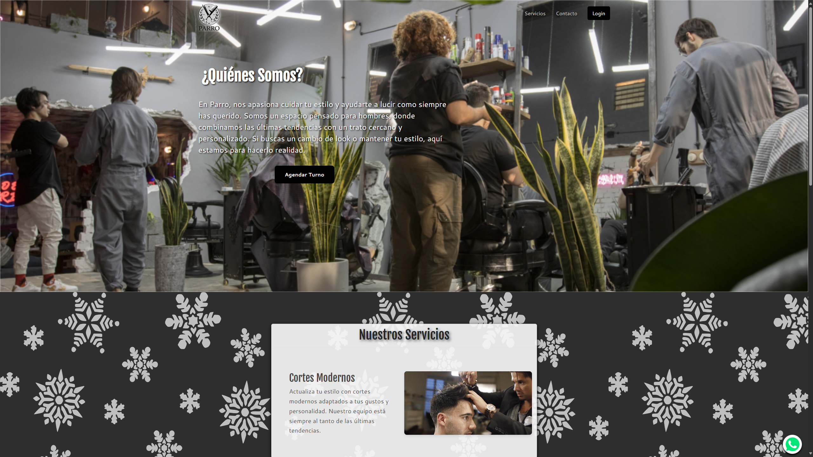
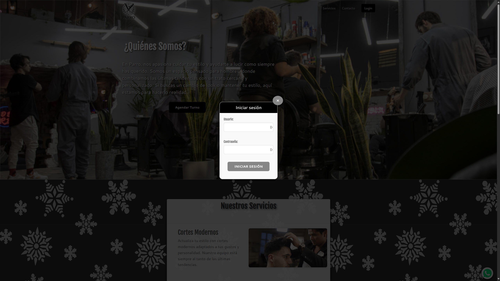
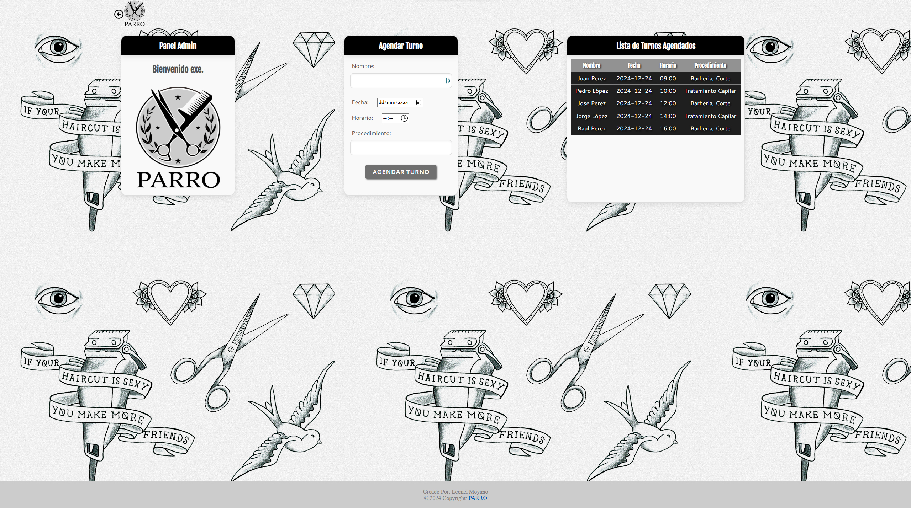

# Peluquería Parro

Este proyecto consta de dos páginas principales: la página de inicio para los clientes y una página de administración para el personal.

## 🏠 Página Principal (index.html)

La página principal ofrece a los clientes información relevante sobre nuestros servicios y el ambiente de la peluquería. Incluye:

- **Información del Negocio**: Detalles sobre nuestros servicios,ubicación y número whatsapp de contacto.

- **Galería de Imágenes y Gif**: Una cuadrícula de fotos y gif que muestran ejemplos de nuestros trabajos y el ambiente del salón.

- **Menú de Navegación**: Acceso fácil a secciones como Servicios, Reservas y Contacto.

- **Formulario de Inicio de Sesión**: Área para que los administradores ingresen al panel de administración.

* Parte del login

## 🔐 Página de Administración (admin.html)

La sección de administración está diseñada para el uso interno del personal de la peluquería. Sus características incluyen:

- **Gestión de Turnos**:
  - **Registro de Nuevos Turnos**: Formularios para agendar citas de clientes.
  - **Visualización de Turnos**: Vista detallada de las reservas del mes en curso, con al menos 5 reservas predefinidas.

## 🛠️ Tecnologías Utilizadas

- **HTML5**: Estructura de las páginas web.

- **CSS3**: Estilos y diseño responsivo para una mejor experiencia de usuario.

- **Bootstrap**: Framework para facilitar el diseño responsivo y componentes predefinidos.

- **JavaScript**: Funcionalidades interactivas, incluyendo la validación del formulario de inicio de sesión.
